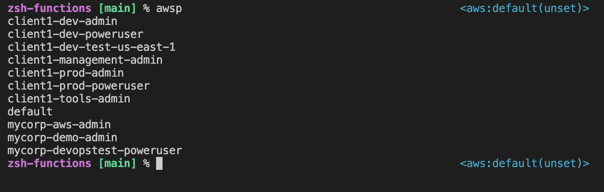
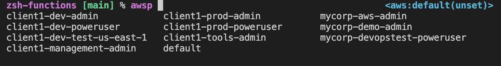
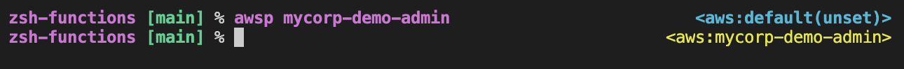
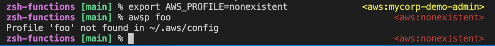

# Useful ZSH functions

## Installation
```
git clone git@github.com:suonto/zsh-functions.git ~/zsh-functions
echo 'source ~/zsh-functions/*.sh' >> .zshrc
```
Open a new zsh terminal.

## Functions
Function descriptions.

### awsp (aws profile selector)
Adds nice colors and easy profile selection with an intuitive autocomplete. Reads profile data from `~/.aws/config`. Colors and color selections are defined in `aws.sh` function `_aws_prompt_info`.

List by default:

Autocomplete:

Colors:

Mistake detection:

